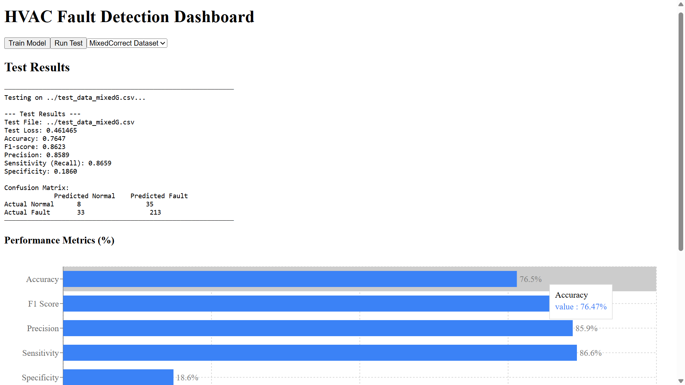

# Source Code Folder
To be structured as needed by project team.

Please document here

| Subdirectory Name | Description |

| Frontend | This directory holds all the files for the frontend main file it's held:`cd /src/HVACPredictor.jsx`. To view the dashboard in action run `npm run dev` This will display a link to the dashboard. But you will notice you will not be able to use any of the buttons, that because we need to run the backend.|

| Backend | This directory holds the api file which is the vehicle that connects the frontend to the backend. To find this file: `cd /backend/api.py` to run the file: `python api.py` once that is running click link given when you run the frontend `http://localhost:5173/` should be similar to this link. Train the model by clicking train model, and then run a run test on any dataset of your choice.  |

| | |
| | |
| | |
| | |
